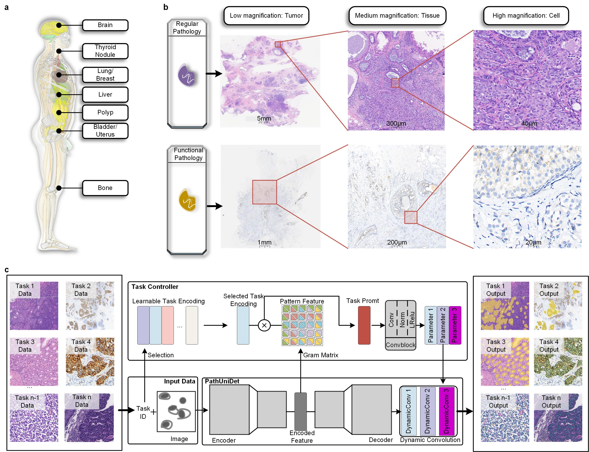

# 
`PathUniDet: A Universal Framework for Scalable and Efficient Pathological Image Detection Across Diverse Tasks and Modalities`

This repository contains the pytorch code for the paper:

PathUniDet: A Universal Framework for Scalable and Efficient Pathological Image Detection Across Diverse Tasks and Modalities ([PDF]())

## Introduction
Pathological examination is the gold standard for diagnosing significant diseases like cancer, but its labor-intensive and time-consuming nature demands efficient deep learning-based assistance. Current approaches often require task-specific models for diverse pathological tasks across varying organs, staining types, and magnifications, leading to high computational costs and limited scalability. To address these challenges, we propose PathUniDet, a universal detection framework capable of handling tumor, tissue, and cell-level analyses in a single model. Leveraging task-specific prompts and dynamic convolutional kernels, PathUniDet achieves robust performance across multiple tasks without requiring manual annotations like bounding boxes or points. Our method outperforms singletask models and existing universal frameworks in segmentation and keypoint detection tasks while significantly reducing computational overhead. Extensive evaluations on 11 upstream and 7 downstream tasks demonstrate its adaptability to various staining methods and magnification scales, achieving consistent accuracy across H&E and IHC-stained images. Additionally, this framework streamlines the training and deployment process, making it particularly suitable for resource-constrained clinical settings.

     

## Dependecies
In the environment configuration, we primarily utilize `torch==1.7.1`.

## Usage

### Data preparation
Before training, you need to prepare the training images and ground truth for each task. 

We set up a folder for all tasks, and within this folder, each task is stored in a separate subfolder. Each task folder contains an ‘img’ folder for storing images and a ‘ground_truth’ folder for storing annotations.

### Pretrained weight: 
Pretrained weight is released:
[GoogleDrive](https://drive.google.com/drive/folders/1izOFT7n4831uutTplyBVGX6WUaj1Mgux?usp=drive_link)

### Model training and test
To training a model, set related parameters and run `python dataset_loading_dodnet_newdataset.py`

To evaluate the trained model on the test set,  run `python caculate_metric_newdataset.py` for segmentation, `python caculate_metric_newdataset_detection.py` for single-class cell detection and `python caculate_metric_newdataset_ki67.py` for ki67 detection. 

the model weight is "model.pkl"

# Data Resources

Please find in the table below some link and information about histopathology dataset that are publicly available.

Dataset name | Organs | Staining | Link | Size | Data | Task | WSI/Patch | Other (Magnification, Scanner) | year
--- | --- | --- | --- |--- |--- |--- |--- |--- |---
Adipocyte| skin | H&E | [data](https://github.com/ieee8023/countception), [paper](https://arxiv.org/abs/1703.08710) | 200 patches | images+mask |  cell detection | patch (120x150) | 40x | 2017
CAMELYON16| Lymph node | H&E | [data](https://camelyon16.grand-challenge.org/), [paper](https://jamanetwork.com/journals/jama/article-abstract/2665774) | Train: 270 (160 Normal, 110 with metastases); Test: 130 | images + binary masks | classi + seg | WSI | slide level analysis | 2016
CoNSeP - HoVer-Net  | Colorectal adenocarcinoma | H&E | [data](https://warwick.ac.uk/fac/cross_fac/tia/data/hovernet/), [paper](https://www.sciencedirect.com/science/article/abs/pii/S1361841519301045?via%3Dihub) | Train: 27 images, Test: 14 images, 24.319 nuclei | images + nuclei (location + class) | instance seg + classi (7: other, inflammatory, healthy epithelial, dysplastic/malignant epithelial, figroblast, muscle, endothelial) | patch (1000x1000) | 40x (UHCW) | 2019
CPM-15| brain | H&E | [data](https://drive.google.com/drive/folders/11ko-GcDsPpA9GBHuCtl_jNzWQl6qY_-I) | 15 (2905 nuclei) | images + nuclei seg + label | seg + classi | patch (400x400, 600x1000) | 20x, 40x (TCGA) | 
CPM-17| brain | H&E | [data](https://drive.google.com/drive/folders/1sJ4nmkif6j4s2FOGj8j6i_Ye7z9w0TfA), [paper](https://www.ncbi.nlm.nih.gov/pmc/articles/PMC6454006/) | Train: 32, test: 32 (7570 nuclei) | images + nuclei seg + label | seg + classi | patch (500x500 to 600x600) | 20x, 40x (TCGA) | 2019
CRAG - MILD-Net| Colon | H&E | [data](https://warwick.ac.uk/fac/cross_fac/tia/data/mildnet/), [paper](https://www.sciencedirect.com/science/article/abs/pii/S1361841518306030?via%3Dihub) | Train: 173, Valid: 40 | image + segmentation | instance seg | patch (around 1500x1500) | 20x | 2019
CryoNuSeg| multiple (10: adrenal gland, larynx, lymph nodes, mediastinum, pancreas, pleura, skin, testes, thymus, and thyroid gland) | H&E | [data](https://www.kaggle.com/datasets/ipateam/segmentation-of-nuclei-in-cryosectioned-he-images), [github](https://github.com/masih4/CryoNuSeg), [paper](https://www.sciencedirect.com/science/article/pii/S0010482521001438) | 8000 nuclei from 30 patches (from 30 wsi) | images + segmentation masks + binary labels | nuclei segmentation | patch (512x512) | 40x (from TCGA) | 2021
GlaS| Colorectal (Gland) | H&E | [data](https://warwick.ac.uk/fac/cross_fac/tia/data/glascontest/), [paper](https://arxiv.org/pdf/1603.00275v2.pdf) | 165 | Train: 85 (37 benign, 48 malignant); Test: 80 (37 benign, 43 malignant) | classi + seg | Patch (diff sizes - few hundred px) | 20x - Zeiss MIRAX MIDI | 2015
Kumar | multiple (8) | H&E | [data](https://drive.google.com/drive/folders/1bI3RyshWej9c4YoRW-_q7lh7FOFDFUrJ), [paper](https://ieeexplore.ieee.org/stamp/stamp.jsp?tp=&arnumber=7872382) | Train: 16 (13.372 nuclei), test same organ (4.130 nuclei): 8, test diff organ (4.121 nuclei): 6 | images + nuclei seg + label | seg + classi | patch (1000x1000) | 40x (TCGA) | 2017
Lizard | Colon | H&E | [data](https://warwick.ac.uk/fac/cross_fac/tia/data/lizard/), [paper](https://arxiv.org/pdf/2108.11195.pdf) | 495.179 nuclei | images + instance seg mask | seg | patch | 20x (DigestPath + CRAG + GlaS + PanNuke + CoNSeP + TCGA) | 2021
MBM | bone | H&E | [data](https://github.com/ieee8023/countception), [paper](https://arxiv.org/abs/1703.08710) | 44 patches | images+mask |  cell detection | patch (600x600) | 40x | 2017
MoNuSeg | multiple (7) | H&E | [data](https://monuseg.grand-challenge.org/Data/), [github](https://github.com/ruchikaverma-iitg/MoNuSeg), [paper](https://ieeexplore.ieee.org/document/8880654) | Train: 30, Test: 14 | images (Train: 22.000 nuclei, Test: 7000) + masks| instance seg | Patch (1000x1000) | 40x (from TCGA) | 2018
OCELOT | Multiple (Bladder, Endometrium, Head-and-neck, Kidney, Prostate, Stomach) | H&E | [data](https://ocelot2023.grand-challenge.org/ocelot2023/), [paper](https://openaccess.thecvf.com/content/CVPR2023/html/Ryu_OCELOT_Overlapped_Cell_on_Tissue_Dataset_for_Histopathology_CVPR_2023_paper.html), [website](https://lunit-io.github.io/research/publications/ocelot/) | 304 Whole Slide Images (WSIs) (tr:val:te 6:2:2) | images + cell annotation + tissue annotation | cell and tissue detection (multitask learning) | patch (1024x1024) | (TCGA) | 2023
CryoNuSeg [21] | multiple (10: adrenal gland, larynx, lymph nodes, mediastinum, pancreas, pleura, skin, testes, thymus, and thyroid gland) | H&E | [data](https://www.kaggle.com/datasets/ipateam/segmentation-of-nuclei-in-cryosectioned-he-images), [github](https://github.com/masih4/CryoNuSeg), [paper](https://www.sciencedirect.com/science/article/pii/S0010482521001438) | 8000 nuclei from 30 patches (from 30 wsi) | images + segmentation masks + binary labels | nuclei segmentation | patch (512x512) | 40x (from TCGA) | 2021
PanNuke  | multiple (19) | H&E | [data](https://warwick.ac.uk/fac/cross_fac/tia/data/pannuke), [github](https://jgamper.github.io/PanNukeDataset/), [paper](https://arxiv.org/pdf/2003.10778.pdf), [paper](https://link.springer.com/chapter/10.1007/978-3-030-23937-4_2) | 189.744 nuclei (from >20k wsi) | images + nuclei (position + classi: neoplastic, connective, non-neoplastic epithelial, dead, inflammatory) | instance seg + classi | patch | 40x | 2019
RINGS | prostate | H&E | [data](https://data.mendeley.com/datasets/h8bdwrtnr5/1) , [paper](https://www.sciencedirect.com/science/article/pii/S0933365721000695)| train: 1000 , test: 500 with 18'851 glands | images+mask |  gland segmentation and tumor segmentation | patch (1500x1500) | 40x | 2021
TNBC | Breast | H&E | [data](https://peterjacknaylor.github.io/data/), [data](https://drive.google.com/drive/folders/1taB8boGyycjV4X1a2vCIAV9fwMxFSS41), [paper](https://ieeexplore.ieee.org/stamp/stamp.jsp?arnumber=8438559) | 50 images, 4022 cells (11 patients) | images + nuclei seg + label | seg + classi | patch (512x512) | 40x - Philips Ultra Fast Scanner (Curie Inst.) | 2019

# Author
1.	Hansheng Li,  lihansheng@nwu.edu.cn, School of Information Science and Technology, Northwest University, Xi’an, Shaanxi, China
2.	Zhengyang Xu, fy1999xu@gmail.com, School of Information Science and Technology, Northwest University, Xi’an, Shaanxi, China
3.	Yuting Zhong, zhongyuting@stu.nwu.edu.cn, School of Information Science and Technology, Northwest University, Xi’an, Shaanxi, China
4.	Mengdi Yan, 202010292@stumail.nwu.edu.cn, School of Information Science and Technology, Northwest University, Xi’an, Shaanxi, China
5.	Yuxin Kang, yuxinkang@yulinu.edu.cn, Yulin University, Department of Information Engineering
6.	Chunbao Wang, bingliziliao2015@163.com, Department of Pathology, The First Affiliated Hospital of Xi’an Jiaotong University, Xi’an, Shaanxi, China
7.	Qirong Bo, boqirong@nwu.edu.cn, School of Information Science and Technology, Northwest University, Xi’an, Shaanxi, China
8.	Jun Feng, fengjun@nwu.edu.cn, School of Information Science and Technology, Northwest University, Xi’an, Shaanxi, China
9.	Lin Yang, linyang@nwu.edu.cn, School of Information Science and Technology, Northwest University, Xi’an, Shaanxi, China
10.	Wentao Yang, yangwt2000@163.com, Fudan University, Shanghai, China
11.	Yuting Wen, 65171495@gq.com, Department of Pathology, the Ninth Hospital of Xi 'an, Shaanxi, China
12.	Yi Wang, wy112421xbb@163.com, Department of Pathology, the Ninth Hospital of Xi 'an, Shaanxi, China
13.	Xianxu Zeng, xianxu77@163.com, Department of Pathology, The Third Affiliated Hospital of Zhengzhou University, Zhengzhou, Henan, China
14.	Lei Cui, leicui@nwu.edu.cn, School of Information Science and Technology, Northwest University, Xi’an, Shaanxi, China

